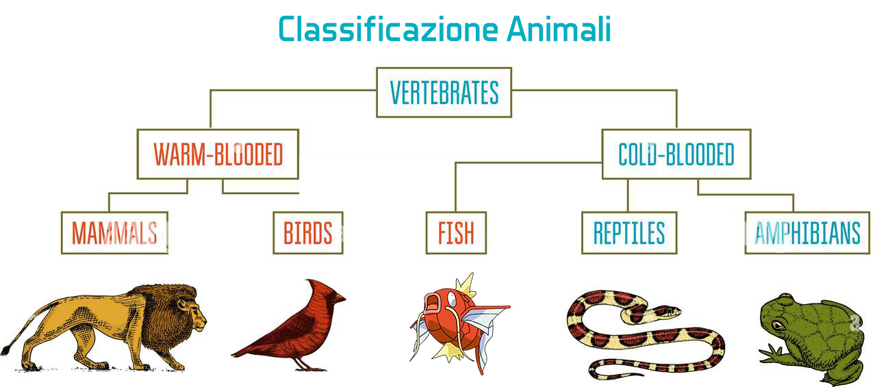

## **ESERCIZIO 1**

Utilizzando i principi di OOP e di Ereditarietà, creare una struttura a classi come segue:

```php
+-|Continent 
+-----------|Country 
+--------------------|Region 
+---------------------------|Province 
+------------------------------------|City
+------------------------------------------|Street
```

Continent genitore con figlio Country, con a sua volta un figlio Region, con a sua volta un figlio Province, con a sua volta un figlio City e infine un figlio Street:

Ogni classe avrà un attributo public del tipo:

```php
$nameContinent: 
$nameCountry; 
$nameRegion: 
$nameProvince: 
$nameCity:
$nameStreet:
```

La prima classe Genitore sarà strutturata come segue:

```php
class Continent
{
  public $nameContinent;

  public function __construct($continent)
  {
    $this->nameContinent = $continent;
  }
}
```

Voglio istanziare un nuovo oggetto chiamato **$myLocation,** subito dopo richiamare un metodo pubblico **getMyCurrentLocation() che mi stampi a video** :

`"Mi trovo in Europa, Italia, Puglia, Ba, Monopoli, Via Roma"`

## **ESERCIZIO 2**

Dato questo semplice schema di classificazione Animale:



Creare una struttura a Classi sfruttando l’ereditarietà e seguendo queste semplici regole: 

1)Le classi **NON** devono avere attributi;

2)Ogni classe avrà un metodo specifico **PROTECTED** per stampare la sua specializzazione (Attenti all’overwrite);

3) Non Potete realizzare metodi definiti dall’utente PUBLIC per stampare il risultato, l’unico metodo PUBLIC ammesso è il Costruttore;

Esempio di Output:

```php
$magikarp = new Fish();

//Nel terminale visaulizzerete:

Sono un animale Vertebrato
Sono un animale a Sangue Freddo
Splash!

//---------------------

$serpente = new Reptile();

//Nel terminale visaulizzerete:

Sono un animale Vertebrato
Sono un animale a Sangue Freddo
Sono un Serepnte
```

## **ESERCIZIO 3**

Dato questo codice:

```php
class Car {
  private $num_telaio; 
}

class Fiat extends Car {
 protected $license;
 protected $color; 
  
}
```

Completare la classe Fiat con le strutture mancanti e, utilizzando il livello di severità che ritenete più opportuno, estendere i metodi **** per stampare a video in un echo:

`"La mia macchina è Opel con targa AGHTYU e numero di Telaio "`

Per sapere se l’esercizio è corretto, stampare in console il var_dump dell’oggetto:

```php
var_dump($car);
```

L’output dovrà avere solamente 3 attributi:

```php
 object(MyCar)#1 (3) {
  ["num_telaio":"Car":private]=>
  string(6) "183784"
  ["nome":protected]=>
  string(4) "Opel"
  ["targa":protected]=>
  string(8) "19384785"
}
```

**E non 4! Dobbiamo modificare l’attributo privato, non crearne uno nuovo.**

```php
 object(MyCar)#1 (4) {
  ["num_telaio":"Car":private]=>
  NULL
  ["nome":protected]=>
  string(4) "Opel"
  ["targa":protected]=>
  string(8) "19384785"
  ["num_telaio":protected]=>
  string(6) "183784"
}
```